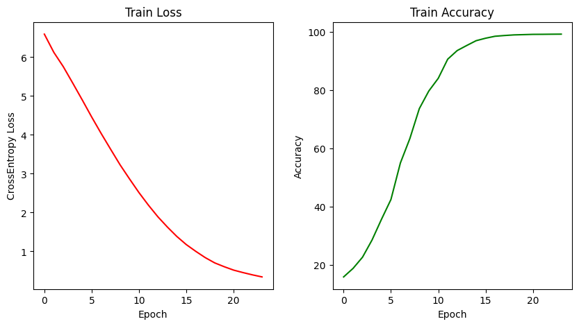

<p align="center">
  <h1 align="center" >Next Word Prediction In Farsi</h1>
</p>

<body>
    <p align="justify">
        Next word prediction is a NLP task
        where a model predicts the most likely word to follow a given sequence of words or context.
        It aims to generate coherent and contextually relevant suggestions
        for the next word based on the patterns and relationships learned from training data.
    </p>
</body>

#### **Quick Links**
- [Dependencies](#Dependencies)
- [Training](#Training)
- [Samples](#Samples)
- [License](#License)

## Dependencies
- Download Pretrained Weights [Here](https://huggingface.co/ordaktaktak/Next-Word-Prediction)

## Training
<p align="center">
  <div align="center"></div>
  <div align="center"><figcaption><strong>Fig. 2: Model Training History.</strong></figcaption></div>
</p>

## Training
```py
query = ["سرمربی تیم ملی", 19]
string_ = Prediction(query)
print(string_)
# Output : سرمربی تیم ملی وزنهبرداری ایران اکنون از این کشور اعلام کرده است که نشان میدهد که به آن
```

```py
query = ["این گونه از کرکسها", 5]
string_ = Prediction(query)
print(string_)
# Output : این گونه از کرکسها مانند بسیاری از پرندگان مشابه
```

## 🛡️ License <a name="license"></a>
Project is distributed under [MIT License](https://github.com/Saeed-Biabani/Next-Word-Prediction/blob/main/LICENSE)
